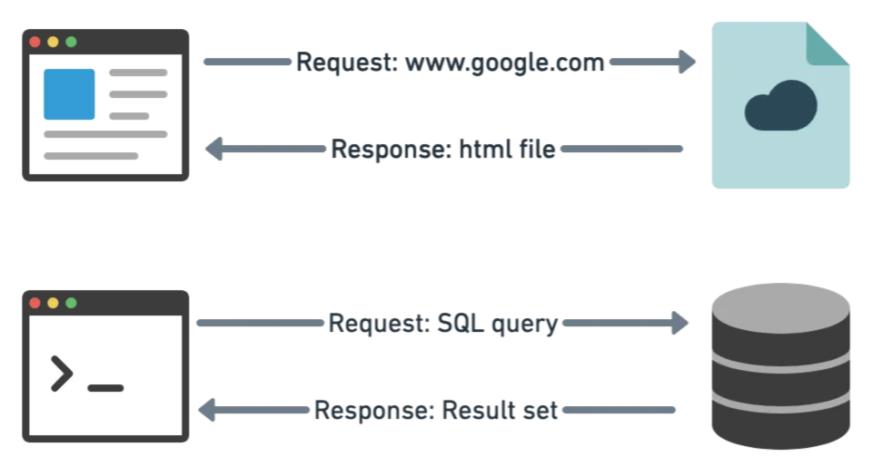
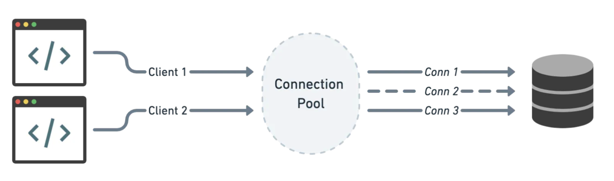
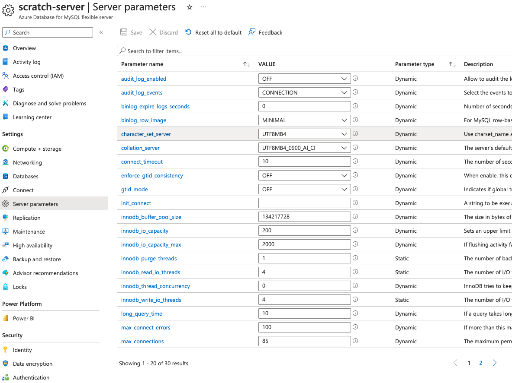

<!-- _class: lead -->

# Database Connection Pooling

**Hants Williams, PhD, RN**

---

## Introduction to Connection Pooling

- **What is a connection**
  - A connection is a communication channel between a database and an application.
  - It is used to send and receive data between the database and the application.



---

## What is Connection Pooling?
  - Connection pooling is a technique to manage and reuse database connections efficiently.
  - It optimizes the process of creating and closing database connections.



---

## Why is Connection Pooling Important?

`select patients from patient;`

To get the result, along with this query we need to provide the database details and our authentication details, usually the host, port, database, username and password. These are needed because before actually running the query, the program has to:

find the database
→ connect to it
→ authenticate our connection
→ use the given db
→ and then run our query.

---

- **Why is Connection Pooling Important?**
  - Reduces the overhead of establishing a new database connection for each transaction.
  - Improves application performance and scalability.
  - Prevents resource exhaustion in high-traffic applications.

---

## Connection Pooling in Cloud Environments

- **Relevance in Cloud-Based Web Applications**
  - Connection pooling is critical for web applications hosted in the cloud.
  - In web applications, there can be thousands or even millions of concurrent database connection attempts.

- **The Challenge of Web Application Scaling**
  - Handling a large volume of database connection requests is a challenge.
  - Efficient connection management is crucial for scaling web applications.

- **Client-Side vs. Server-Side Connection Pooling for Web Apps**
  - Considerations for choosing between client-side and server-side connection pooling in web applications.
  - How each approach impacts web app performance and scalability.

---

## Connection Pooling Mechanisms

- **Types of Connection Pooling**
  - **Client-Side Connection Pooling:** Managed by the application.
  - **Server-Side Connection Pooling:** Managed by the database server.
  - **Cloud-Managed Connection Pools:** Provided by cloud platforms.

---

## Client Side
- In the next example, the Flask app uses SQLAlchemy for client-side connection pooling. 
- It configures SQLAlchemy to manage the connection pool with the specified pool size and max overflow settings. The models module is assumed to contain the SQLAlchemy models for the database schema.

---
```python
from flask import Flask, request
from sqlalchemy import create_engine
from sqlalchemy.orm import sessionmaker
from dotenv import load_dotenv
# from models import Patient  # Assuming you have SQLAlchemy models defined

app = Flask(__name__)

# SQLAlchemy setup with client-side connection pool
db_uri = "mysql+mysqlconnector://db_user:db_password@db_host/db_name"
engine = create_engine(db_uri, pool_size=5, max_overflow=10)
Session = sessionmaker(bind=engine)

@app.route('/get_patient/<patient_id>')
def get_patient(patient_id):
    session = Session()
    # patient = session.query(Patient).filter_by(id=patient_id).first()
    patient = session.execute("SELECT * FROM patients WHERE id=:patient_id", {"patient_id": patient_id}).fetchone()
    session.close()
    return f"Patient: {patient.first_name} {patient.last_name}"
```
---

## Server Side
- In the next example, the Flask app relies on a cloud database service with built-in server-side connection pooling, such as Google Cloud SQL (as mentioned earlier).

---

```python
from flask import Flask
from sqlalchemy import create_engine
from sqlalchemy.orm import sessionmaker
from dotenv import load_dotenv

load_dotenv()
db_route = os.getenv("DB_ROUTE")

app = Flask(__name__)

# Server-side connection pool setup (Google Cloud SQL)
cloud_sql_connection = create_engine(db_route)
Session = sessionmaker(bind=cloud_sql_connection)

@app.route('/get_patient/<patient_id>')
def get_patient(patient_id):
    session = Session()
    patient = session.execute("SELECT * FROM patients WHERE id=:patient_id", {"patient_id": patient_id}).fetchone()
    session.close()
    return f"Patient: {patient}"
```

---

## Azure and GCP Connection Pooling Services

- **Azure Connection Pooling Services**
  - https://learn.microsoft.com/en-us/azure/mysql/flexible-server/concepts-server-parameters
  - The value of max_connection is determined by the memory size of the server.
  - "...For best experience, we recommend that you use a connection pooler like ProxySQL to efficiently manage connections."
  - https://proxysql.com/ 

---

  - 


---

## Azure and GCP Connection Pooling Services

- **GCP Connection Pooling Services**
  - Cloud SQL imposes overall connection limits that cannot be exceeded.
  - Creating and using fewer connections reduces overhead and helps you stay under the connection limit.
  - By default, you can have up to 1000 instances per project except in some cases, where you might have a limit of 100
  - https://cloud.google.com/sql/docs/mysql/quotas#configurable-limits
  - https://cloud.google.com/sql/docs/mysql/quotas#configurable-limits
  - [Link](https://cloud.google.com/sql/docs/mysql/manage-connections)

---

## Best Practices and Optimization
- **Configuring Connection Pools**
  - **Pool Size:** Set an appropriate pool size based on your application's concurrency needs. It determines the maximum number of connections that can be opened simultaneously. Be mindful of database server limitations and available resources.
  - **Timeout Settings:** Configure connection timeout settings to avoid blocking application threads indefinitely. When a connection request can't be fulfilled within the specified timeout, it should raise an exception or return an error.
  - **Connection Pooling in Cloud Services:** If using cloud-managed databases, understand the connection pooling features provided by the cloud service. Configure them according to your application's requirements.

---
## Best Practices and Optimization
- **Monitoring and Troubleshooting**
  - Regularly monitor connection pool metrics, such as connection utilization, connection creation time, and error rates. Use tools like database logs, application performance monitoring (APM), or cloud monitoring services.
  - Set up alerting for critical pool-related events, such as high connection wait times or resource exhaustion.

---
## Best Practices and Optimization
-   **Security Concerns Related to Connection Pooling:**
  - **Credential Management:** Safeguard database credentials used in connection pooling. Avoid hardcoding credentials in source code or configuration files. Instead, use environment variables, secrets management tools, or identity providers.
  - **Audit Logging:** Enable audit logging for connection pool activities. Log connection requests, successful connections, and connection failures. Regularly review and analyze these logs for unusual or suspicious activities.
  - **IP Whitelisting:** Restrict access to the database by whitelisting trusted IP addresses or IP ranges that are allowed to connect.

---


