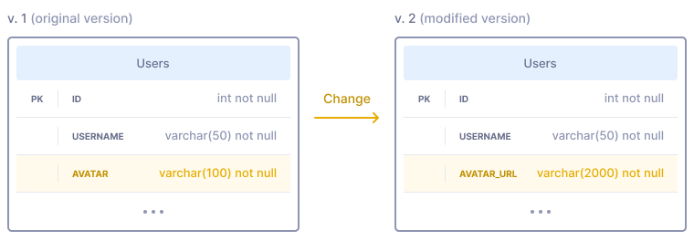

<!-- _class: lead -->

# Introduction to DB Migrations

**Hants Williams, PhD, RN**

---

---

## Interesting things

- Want to help me Thursday? Ping me on teams, looking for assistance during a lecture.
- Rockhealth
  - https://www.linkedin.com/feed/update/urn:li:activity:7119732365920210945/ 
  - https://rockhealth.com/insights/on-the-road-to-impact-mile-markers-for-early-stage-digital-health-startups/ 
- Adrian Olsweksi
  - https://www.linkedin.com/posts/adrianolszewski_hypothesistesting-statistics-datascience-activity-7117123896939544578-GAjp

---

# Database Migrations with SQLAlchemy

## Introduction to Database Migrations

- **What are Database Migrations?**
  - Database migrations involve making structured changes to a database schema.
  - Essential for evolving database applications while preserving data integrity.

---
- **Why are Migrations Important?**
  - Support application updates, bug fixes, and new features.
  - Enable collaboration among development teams.
  - Ensure data consistency during schema changes.

---

## Types of Database Migrations

- **Schema Migrations**
  - Alter the structure of database tables (e.g., add, modify, or delete columns).
  - Maintain data integrity while evolving the schema.
- **Data Migrations**
  - Transfer data between tables or databases.
  - Necessary when schema changes affect data storage.
- **Combining Schema and Data Migrations**
  - Often, both schema and data migrations are performed together.

---

## Migration Tools and Frameworks

- **SQLAlchemy**
  - A powerful Python library for working with databases.
  - Provides SQLAlchemy Migrations for managing database schema changes.
  
- **Other Migration Tools**
    - Alembic (Sqlalchemy Migrations)
    - Django Migrations
    - Prisma 
    - Flyway

---

## Why not write raw SQL for migrations, and use Sqlalchemy? 

- **Database Agnosticism**: SQLAlchemy Alembic provides an abstraction layer that allows you to write database migration scripts in a database-agnostic way. This means you can write migration code once and apply it to multiple database management systems (e.g., MySQL, PostgreSQL, SQLite) without modification. Writing raw SQL queries for migrations would require writing different scripts for each database, making it less portable and maintainable.

- **Version Control and History**: SQLAlchemy Alembic keeps a version history of your database schema changes, making it easier to track and manage the evolution of your database over time. When you write raw SQL queries for migrations, maintaining a version history and managing database changes becomes more challenging and error-prone. Alembic's versioning system helps ensure consistency and reliability in applying migrations.

---

## SQLAlchemy for Database Migrations

- **Why Use SQLAlchemy for Migrations?**
  - Integration with popular databases like MySQL, PostgreSQL, etc.
  - Pythonic syntax for defining and executing migrations.
  - Easily customizable for complex migration scenarios.

---

- **Basic Steps for Using SQLAlchemy Migrations**
  1. Define migration scripts.
  2. Create a migration repository.
  3. Generate an initial migration script.
  4. Apply migrations to the database.

---

- **Demo: Creating a Simple Migration with SQLAlchemy**

---

## Performing Migrations on Remote Databases

- **Cloud Database Hosting (Azure/GCP)**
  - Host your MySQL database on Azure or Google Cloud Platform for scalability, reliability, and global reach.

- **Connecting to Remote Databases**
  - Configure SQLAlchemy to connect to your remote database.

- **Executing Migrations on Remote Databases**
  - Apply migrations remotely to update the database schema.

- **Demo: Performing Migrations on a Remote MySQL Database**

---

