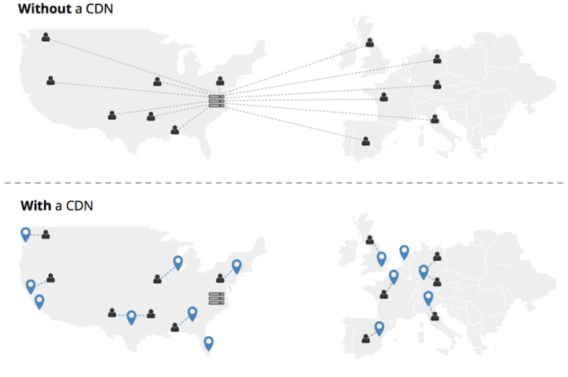
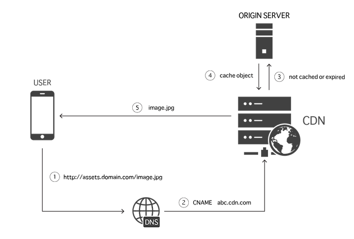

<!-- _class: lead -->

# CDNs: Content Delivery Networks

**Hants Williams, PhD, RN**

---

# Question: 

When you go to a website, what are you pulling from the server?

---

# Answer:

- HTML
- CSS
- JavaScript

You can go to the Network tab in Chrome Dev Tools to see what is being pulled from the server.

---

# Question:

What happens when you go to a website that has a lot of images?

---

# Answer:

- The images are pulled from the server
- The images are cached in your browser

---

# Question:

What happens when you go to a website that has a lot of images and a lot of users?

---

# Answer:

- The images are pulled from the server
- The images are cached in your browser
- The images are cached in the server

Depending on the number of users, the server can get overwhelmed with requests for images.

---

# What is a CDN?

A Content Delivery Network (CDN) is a system of distributed servers that deliver web content and other web services to users based on their geographic location, the origin of the web page, and a content delivery server.

---

# Without a CDN 

---

1. Client makes a request to http://assets.domain.com/image.jpg
2. A DNS server forwards the request to the CDN server

--- 

3. If image.jpg is not cached in the CDN or has expired, then CDN makes a request to the origin server that contains the resources

--- 

4. Origin (resource) responds and CDN caches the image.jpg
5. CDN responds with image.jpg

--- 

# Importance of CDNs

- **Speed:** Faster loading times for your website or web app
- **Reliability:** Improved availability and reliability of your content
- **Security:** Enhanced security with features like DDoS protection
- **Scalability:** Easily handle traffic spikes and scale your resources

---

# Main Functions of CDN Servers

1. **Request Routing:** Directs user requests to the nearest server
2. **Caching:** Stores copies of content on multiple servers
3. **Content Delivery:** Delivers content from the nearest server to the user

---

# How request routing works

1. **User Request:** A user sends a request to access specific content on a website or application.
2. **DNS Resolution:** The DNS server resolves the domain name to the IP address of the nearest CDN server.
3. **Server Selection:** The CDN's **load balancer** selects the optimal server based on factors like proximity, server load, and health status.
    - A load balancer is a device or software application that distributes incoming network traffic across multiple servers to ensure no single server is overwhelmed with too much traffic.
4. **Content Delivery:** The content is delivered to the user from the selected server.

---

# How caching works

1. **Content Storage:** When a user accesses a website or application, the CDN stores copies of static content like images, CSS files, and JavaScript files on its servers.
2. **Cache Hits and Misses:** When a user requests content, the CDN checks if the content is in its cache.
    - **Cache Hit:** If the content is available, it is delivered to the user from the nearest server.
    - **Cache Miss:** If the content is not available, it is fetched from the origin server and then stored in the cache for future requests.
3. **Cache Expiry:** Cached content has an expiry time after which it is refreshed from the origin server to ensure users receive the latest content.
4. **Cache Purging:** Stale or outdated content can also be manually purged from the cache by the website owner.

---

# Major CDNs

There are several major Content Delivery Networks (CDNs) that dominate the market, each with its own unique features and global reach.

1. **Akamai Technologies**
   - One of the oldest and largest CDNs, with a vast network of servers worldwide.
   - Offers a wide range of services including web performance, mobile performance, and security solutions.
   - Serves approximately 15-30% of all web traffic 
   - Live view: https://www.akamai.com/internet-station

---

2. **Cloudflare**
   - Known for its security features, including DDoS protection and web application firewall.
   - Has a large global network of data centers.
   - Serves approximately 10-20% of all web traffic (https://blog.cloudflare.com/application-security/)
   - Live view: https://radar.cloudflare.com/us 

---

3. **Fastly**
   - Focuses on real-time content delivery and edge computing.
   - Offers a highly programmable CDN with real-time analytics.
   - Live view: https://www.fastly.com/network-map/ 

4. **Amazon CloudFront**
   - Integrated with Amazon Web Services (AWS) for seamless cloud integration.
   - Offers a global network of servers and a pay-as-you-go pricing model.

---

5. **Google Cloud CDN**
   - Integrated with Google Cloud Platform (GCP) for seamless cloud integration.
   - Offers global load balancing, Anycast IP addresses, and HTTP/HTTPS load balancing.
   - *Cloud CDN* and *Media CDN* are two separate products offered by GCP for content delivery.
        - Media CDN: https://cloud.google.com/media-cdn/docs/overview
        - Cloud CDN: https://cloud.google.com/cdn/docs/overview 

---

6. **Microsoft Azure CDN**
   - Integrated with Microsoft Azure for seamless cloud integration.
   - Offers a global network of servers, real-time analytics, and custom domain support.
   - *Azure Front Door*
        - Front Door: https://azure.microsoft.com/en-us/products/frontdoor 

