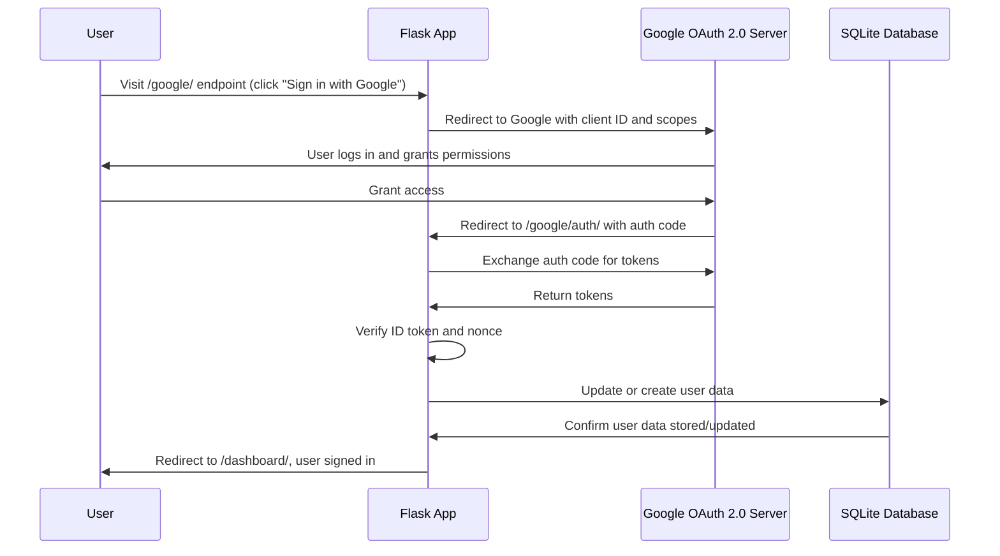

```mermaid

sequenceDiagram
    participant User
    participant FlaskApp as Flask App
    participant GoogleOAuth as Google OAuth 2.0 Server
    participant Database as SQLite Database

    User->>FlaskApp: Visit /google/ endpoint (click "Sign in with Google")
    FlaskApp->>GoogleOAuth: Redirect to Google with client ID and scopes
    GoogleOAuth->>User: User logs in and grants permissions
    User->>GoogleOAuth: Grant access
    GoogleOAuth->>FlaskApp: Redirect to /google/auth/ with auth code
    FlaskApp->>GoogleOAuth: Exchange auth code for tokens
    GoogleOAuth->>FlaskApp: Return tokens
    FlaskApp->>FlaskApp: Verify ID token and nonce
    FlaskApp->>Database: Update or create user data
    Database->>FlaskApp: Confirm user data stored/updated
    FlaskApp->>User: Redirect to /dashboard/, user signed in

```