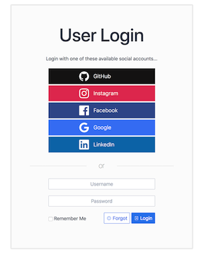
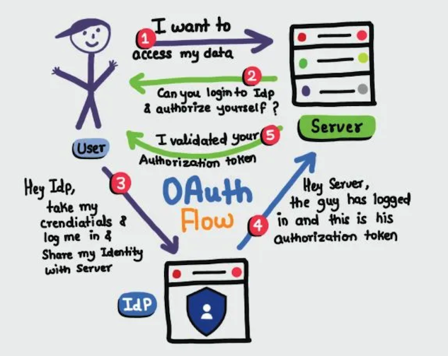
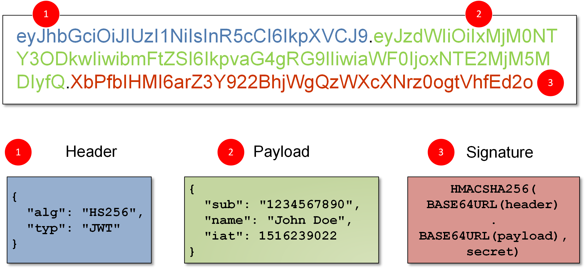
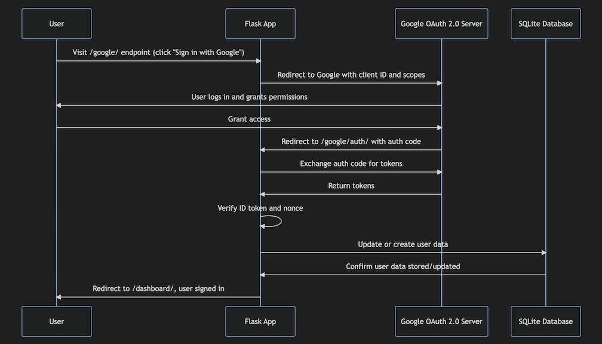

<!-- _class: lead -->

# Authentication Mechanisms 
## Focus on OAuth 2.0

**Hants Williams, PhD RN**

---

### Overview of Authentication
# What is Authentication?

- **Definition:** The process of verifying the identity of a user or system.
- **Importance in Health Informatics:**
  - Protecting patient data
  - Ensuring compliance with regulations (HIPAA, GDPR, etc.)
- **Common Methods:**
  - Passwords
  - Multi-factor Authentication (MFA)
  - Biometric Verification

---

# Common Authentication Methods: Cons

### Passwords
  - Prone to being guessed or stolen; Often reused across services

### Multi-factor Authentication (MFA)
  - Can be inconvenient for users; Relies on user's access to secondary device or token

### Biometric Verification
  - Privacy concerns; Can be expensive to implement; Not foolproof, can be tricked with sophisticated replicas

---

### The Need for OAuth 2.0
# Why OAuth 2.0?

- **Traditional Auth vs OAuth**
  - OAuth provides delegated access without sharing password with the application (client).
- **Use Cases in Health Informatics**
  - Access to medical records
  - Integration with third-party apps
  - Research data sharing

---
### The Need for OAuth 2.0 (cont.)

- Allows a user to grant a third-party application access to their data stored with another service provider (e.g., Google, Facebook, etc.)
- From a user perspective --> `Single Sign-On (SSO)`, no need to create a new account or remember a new password

---

# OAuth 1.0 vs OAuth 2.0
- **OAuth 1.0:**
  - Design for web applications only
  - Not backwards compatible with OAuth 2.0
- **OAuth 2.0:**
  - Designed for mobile and web applications, APIs, and IoT devices
  - Simpler and more flexible than OAuth 1.0

---
# Key Terms in OAuth 2.0
- **Roles in OAuth 2.0:**
  - **User** (Resource Owner): The user who owns the data.
  - **Client** (our Server): The application requesting access to the data. (e.g., flask app)
  - **IdP**: Identity Provider (Authorization Server): The server that authenticates the user and issues access tokens (e.g., google, facebook, microsoft, etc...)

---
### OAuth 2.0 Flow
# Simplified 

---

1. User: I want to access my data on a server. 
- this server in our example is a flask application

---
2. Client (flask server): Can you login to IdP (identity provider) and authorize yourself? 

*Examples of IdP for common social logins: Google, Facebook, Twitter, etc.*
*Examples of IdP services for enterprise: Microsoft Active Directory, Okta, Auth0* 

---

# Azure/Microsoft Active Directory (AD)

- Probably the most common IdP for enterprise applications
- Azure AD is a cloud-based identity and access management service that helps employees sign in and access resources in:
    - External resources, such as Microsoft Office 365, the Azure portal, and thousands of other SaaS applications.
    - Internal resources, such as apps on your corporate network and intranet, along with any cloud apps developed by your own organization.

- All use JWT (JSON Web Token) to encode user information

---

# JWT (JSON Web Token)

- JWT (JSON Web Token)
- JWT is a compact, URL-safe means of representing claims to be transferred between two parties. Example JWT structure:
    - Header: `{"alg": "HS256", "typ": "JWT"}`
    - Payload: `{"sub": "1234567890", "name": "John Doe", "iat": 1516239022}`
    - Signature: `HMACSHA256(base64UrlEncode(header) + "." + base64UrlEncode(payload), secret)`

- **Example:** Google Sign-In, Microsoft Azure Active Directory, etc.

---

---

3. User: Yes - here is my credentials and log me in, share my identity with the client via IdP (google)
    - user does not share the credentials with the client directory, but with the IdP
    - IdP does not share the users username/password with the client unless the user authorizes it, instead it shares an access token
    - this is one of the key benefits of OAuth 2.0, the user does not share their credentials with the client

---

4. IdP: Provides an access token, which is sent to the client
5. Client: Uses the access token to access the user's data on the server, validating the token with the IdP

---

# OAuth 2.0 Flow

---

### OAuth 2.0 in Health Informatics
# OAuth 2.0 in Health Informatics

- **HIPAA Compliance:**
  - Ensures that ePHI is only shared with authorized parties.
- **Scopes and Consent:**
  - Fine-grained access control with explicit user consent.
- **Tokenization:**
  - Use of tokens instead of credentials prevents exposure during transmission.

---

### Practical Lab Introduction
# Practical Lab: Flask and OAuth 2.0
- Demo of working examples
- **Goal:**
  - Implement OAuth 2.0 in a simple Flask application.
- **Tools:**
  - Python
  - Flask framework
  - SQLite for user data storage
- **Learning Outcomes:**
  - Understand OAuth 2.0 integration
  - Hands-on experience with secure authentication

---

# Cloud: Google vs Azure

1. Google Service: Oauth API: https://console.cloud.google.com/apis/credentials
2. Azure Cloud Service: Microsoft Entra ID 

- Both services have similar features (e.g., user management, authentication, etc.)
- Azure tutorial that would need to be moded (not required): https://learn.microsoft.com/en-us/training/modules/add-sign-in-support-python-web-app-identity-platform/ 

---

### Google Lab Setup
# Setting Up for the Lab
- Ensure you have the following installed:
  - Python 3
  - Flask
  - SQLite3
- Clone the lab repository:
- Acquire OAuth 2.0 credentials:
  - Register the application with Google

---

# Understanding Sessions in Flask

- **What is a Session?**
  - A way to store information (in variables) to be used across multiple pages.
  - Session data is stored on the server.
  - We will learn later session data can be stored on the browser as well (cookies, local storage, etc.)

- **Client-Server Interaction:**
  - When a client makes a request, Flask checks for session data.
  - Flask then loads session data 

---

# Session Variables in Flask

- In Flask, the session object is a dictionary that stores key-value pairs of session variables.
- You can set a session variable by using the session object and the `[]` operator.
    - `session['username'] = 'admin'`
- You can access a session variable by using the `[]` operator.
    - `username = session['username']`