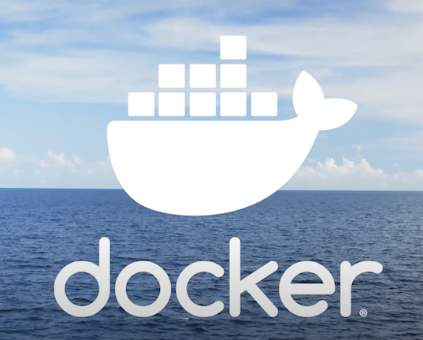

<!-- _class: lead -->

# Solving Deployment 
## Introduction to Docker in Health Informatics

**Hants Williams, PhD, RN**

---

# Problem: Inconsistencies Across Environments

Flask applications often face deployment challenges due to variations in:

- **Operating Systems:** Differences between development and production OS can lead to unexpected behaviors.
- **Python Versions:** Discrepancies in Python versions can cause compatibility issues.
- **OS Versions:** Different versions of the same OS may have varied dependencies or system characteristics.

---

# Impact of Environmental Inconsistencies

These variations can lead to:

- **"Works on My Machine" Syndrome:** The application runs perfectly in the development environment but fails in production.
- **Dependency Hell:** Conflicts arising from different versions of libraries and tools.
- **Increased Time to Deployment:** More time spent troubleshooting and resolving environment-specific issues.

---

# Example Scenario

- A Flask application developed on Windows 10, Python 3.8 might face issues when deployed on a Linux server running Python 3.6.
- Discrepancies in OS-specific dependencies or Python's minor version differences can cause the application to malfunction.

---

# Solution? **Docker!**

---

Docker in 100 seconds 



https://www.youtube.com/watch?v=Gjnup-PuquQ 


---

# Examples that some of you have seen: 

- **Hannah** project -> Mindlamp -> Docker deployment of server
- **Smoking cessation** -> Richard -> Difficulites sharing code and running 

---

# Overview and Significance

Why Docker is crucial in modern Health Informatics:

1. **Efficiency in Deployment:** Streamlines the process of deploying applications.
    - deploy in 2-3 lines of code
2. **Consistency Across Environments:** Ensures uniformity from development to production.
    - OS, Python, and library versions are identical

---

3. **Isolation of Applications:** Each container operates independently.
    - no conflicts between applications
    - security and privacy
4. **Resource Optimization:** Lightweight compared to traditional virtual machines.
    - less overhead
    - faster startup

---

# Docker: A Brief History

Docker started as an internal project at a company called dotCloud, a Platform-as-a-Service (PaaS) company.

- **Founding:** Created by Solomon Hykes as part of a project called dotCloud in 2010.
- **Initial Purpose:** To streamline application deployment on their PaaS platform.
- **Open-Source:** Docker was released as open-source in March 2013 during the PyCon Conference.

---

# Docker's Rise to Popularity

- **Innovation:** Introduced containerization as a lightweight alternative to traditional virtualization.
- **Community and Ecosystem:** Quickly gained popularity in the developer community, leading to a robust ecosystem.
- **Docker, Inc.:** dotCloud changed its name to Docker, Inc. in 2014, shifting its focus solely to developing Docker.

---

# What is Docker?

Docker is a platform for developing, shipping, and running applications in isolated environments called containers.

- **Dockerfile:** The 'DNA' of a Docker image, containing the blueprint for building an image.
- **Images:** Like a grown organism developed from DNA, these are the blueprints for creating Docker containers.
- **Containers:** The living instances, encapsulating an application and its dependencies in a controlled environment.
- **Docker Engine:** The ecosystem that brings everything to life, managing the creation and lifecycle of Docker containers.

---

# Examples of Dockerfiles 

- Is usually just called `Dockerfile`
- A dockerfile is a text document that contains all the commands a user could call on the command line to assemble an image.
- Example of a simple dockerfile: 

```dockerfile
FROM python:3.8-slim-buster
WORKDIR /app
COPY requirements.txt requirements.txt
RUN pip3 install -r requirements.txt
COPY . .
CMD [ "python3", "-m" , "flask", "run", "--host=5000"]
```

---

# Building the image

- `docker build -t <image_name> .`
- The `-t` flag is used to tag the image with a name that is easy to remember.
- The `.` at the end of the command is the path to the directory that contains the Dockerfile. DONT FORGET THIS!!! 
- This command needs to be run in the same directory as the Dockerfile.

---

# Running the image
- `docker run -p 5000:5000 <image_name>`
- The `-p` flag is used to map the port of the container to the port of the host machine.
- The first `5000` is the port of the host machine and the second `5000` is the port of the container.
- This command needs to be run in the same directory as the Dockerfile.

--- 

# The docker engine: 

- The docker engine is the ecosystem that brings everything to life, managing the creation and lifecycle of Docker containers.
- The docker engine is made up of the docker client, docker daemon, and docker registries.
    - **Docker client**: The primary way that many Docker users interact with Docker. When you use commands such as docker run, the client sends these commands to dockerd, which carries them out. The docker command uses the Docker API. The Docker client can communicate with more than one daemon.
    - **Docker daemon**: The background service running on the host that manages building, running and distributing Docker containers. The daemon is the process that runs in the operating system to which clients talk to.

---

# The Docker Metaphor: DNA to Organism

- **Dockerfile (DNA):** Contains the instructions for creating an image. It's akin to DNA, dictating the characteristics and functionality of the image.
- **Image (Developed Organism):** Built from the Dockerfile, it's a static snapshot of the application's environment and dependencies, much like an organism developed from DNA.
- **Container (Living Instance):** A runtime instance of the image, akin to a living organism, executing in its environment.
- **Docker Engine (Ecosystem):** Facilitates the entire process from interpreting the Dockerfile to running the containers, like an ecosystem supporting the life cycle of an organism.

---

# Docker vs Traditional Virtualization

Understanding the difference:

- **Virtual Machines (VMs):**
  - Run a full-blown operating system.
  - Heavier and more resource-intensive.
- **Docker Containers:**
  - Share the host system’s kernel.
  - Lightweight and start faster.

---

# The Role of Docker in Health Informatics

- **Secure Data Processing:** Ensures data privacy and compliance.
- **Scalable Analytics:** Facilitates the handling of large health datasets.
- **Application Isolation:** Prevents conflicts between different health apps.
<br />
- Two primary competitors (non big clouds): Medstack vs Aptible 

---

# MedStack: Simplifying Compliance

- **What It Does:** Offers a secure, compliant hosting environment for healthcare apps.
- **Docker Integration:**
  - Developers provide Docker images of their healthcare applications.
  - MedStack handles security, privacy, and compliance requirements automatically.
- **Benefits:** Reduces the burden of managing compliance with healthcare regulations.

https://medstack.co/ 

---

# Aptible: Secure and Compliant Deployments

- **What It Offers:** A platform for deploying compliant healthcare applications.
- **Docker Usage:**
  - Developers deploy their applications via Docker images.
  - Aptible automates security measures and provides audit logs.
- **Advantages:** Streamlines the process of meeting stringent healthcare security standards.

https://www.aptible.com/security-compliance 

---

# Automation of Security and Compliance

Both MedStack and Aptible:

- **Automate Security:** Implement robust security measures around the Docker containers.
- **Manage Audit Logs:** Provide comprehensive logging for regulatory compliance.
- **Ease of Use:** Allow developers to focus on application development rather than infrastructure management.


---

# Docker (1)Files, (2)Images, (3)Containers and now Registries

- **Docker Files:**
  - Text files containing instructions for building Docker images.
  - Used to create Docker images.
- **Images:**
  - Read-only templates used to create containers.
- **Registries:**
  - Repositories for storing Docker images.
  - Examples: Docker Hub, Azure Container Registry.
- **Containers:**
  - Run-time instances of Docker images.

---

# What are Docker Registries

- **What They Are:** 
    - Repositories for storing Docker images.
    - Helpful for distributing and versioning Docker images.
    - When working with Docker, you'll often pull images from a registry 
    - In the public registeries, many organizations and individuals share their images. Usually the maintainers of the software (image) will also maintain the image in the registry.
- Examples of common images: 
    - `python:3.8-slim-buster` - slim version of python 3.8
    - `ubuntu:20.04`- ubuntu 20.04
    - `linux:latest` - latest version of linux
    - `mysql:8.0.23` - mysql 8.0.23

---

# What are Docker Registries

- Examples of registries: 
    - **Public Docker Hub:** Central repository for Docker images.
    - **Azure Container Registry:** Private registry for storing container images.
- **Role in Deployment:** Registries play a key role in the distribution and version control of Docker images.
    - Think of github, but for docker images.

---

# Managing Docker Images and Containers

Basic operations include:

- **Pulling Images:** Downloading images from a registry.
- **Building Containers:** Creating containers from images.
- **Running Containers:** Starting and managing container instances.

---

# Cloud:

## Azure: 

- https://learn.microsoft.com/en-us/azure/container-instances/container-instances-tutorial-prepare-app
- In this tutorial, you can follow along to build an image, create a registry, and then push the image to the registry, and once that happens you finally can deploy the container to Azure Container Instances.

---

# Examples: 

- Hello Work 
- Basic flask app 

---

# Docker Compose
## (additional material)

---

# Managing Multiple Services in Docker

Addressing the challenge of inter-service communication in Docker.

---

# Coordinating Services: Flask and MySQL

What if your application architecture involves multiple services that need to communicate with each other?

- **Example:** A Flask application that interacts with a MySQL database.
- **Challenge:** Ensuring seamless communication and management between these services.

---

# Docker Compose: A Solution

Introducing Docker Compose:

- **What It Is:** A tool for defining and running multi-container Docker applications.
- **How It Works:** Uses a YAML file to configure application services.
- **Benefits:** Simplifies the management of applications with multiple interconnected containers.

---

# Docker Compose File: The Blueprint

The `docker-compose.yml` file is a YAML file that defines how Docker containers should interact in your application.

- **File Extension:** `.yml` or `.yaml`
- **Language:** Written in YAML (Yet Another Markup Language), known for its readability and ease of use.
- **Location:** The file should be placed in the root directory of your application.

---

# Composition of a Docker Compose File

Key components of a `docker-compose.yml` file include:

- **Services:** Each service (e.g., web application, database) is defined here, along with its configuration.
- **Networks:** Specifies the networks your containers will use to communicate.
- **Volumes:** Defines persistent storage for your containers.

---

# Example: Docker Compose File

Services: Here, two services are defined: web (a Flask app) and db (a MySQL database).

```yaml
version: "3.9"
services: # services are the containers
  flask: # name of the container, this is a python app 
    build: .
    ports:
      - "5000:5000"
    volumes:
      - .:/app
    depends_on: # this is the db service, so it depends on the db service
      - db
  db: # name of the container, this is a mysql db
    image: mysql:5.7
    volumes:
      - db_data:/var/lib/mysql
    environment:
      MYSQL_ROOT_PASSWORD: password
      MYSQL_DATABASE: flask_db
      MYSQL_USER: flask_user
      MYSQL_PASSWORD: password

```

---

# Essential Docker Commands 
- Building an image: `docker build -t [image-name] .`
- Running an image: `docker run -p [host-port]:[container-port] [image-name]`
- Listing images: `docker images`
- Listing containers: `docker ps`
- Stopping a container: `docker stop [container-id]`
- Removing a container: `docker rm [container-id]`
- System prune (clean and remove everything): `docker system prune -a -f`

---

# Essential Docker Compose Commands
- Building images: `docker-compose build`
- Running containers: `docker-compose up`
- Stopping containers: `docker-compose down`
- Listing containers: `docker-compose ps`
- Removing containers: `docker-compose rm`
- Removing volumes: `docker-compose down -v`
- Cleaning and removing everything: `docker-compose down -v --rmi all --remove-orphans`