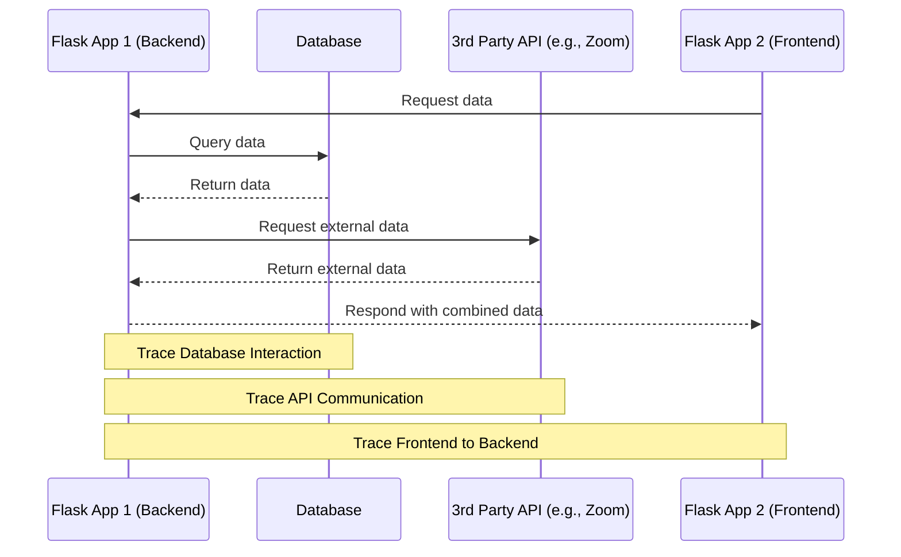

```mermaid
sequenceDiagram
    participant F1 as Flask App 1 (Backend)
    participant DB as Database
    participant API as 3rd Party API (e.g., Zoom)
    participant F2 as Flask App 2 (Frontend)

    F2->>F1: Request data
    F1->>DB: Query data
    DB-->>F1: Return data
    F1->>API: Request external data
    API-->>F1: Return external data
    F1-->>F2: Respond with combined data

    Note over F1,DB: Trace Database Interaction
    Note over F1,API: Trace API Communication
    Note over F2,F1: Trace Frontend to Backend
```