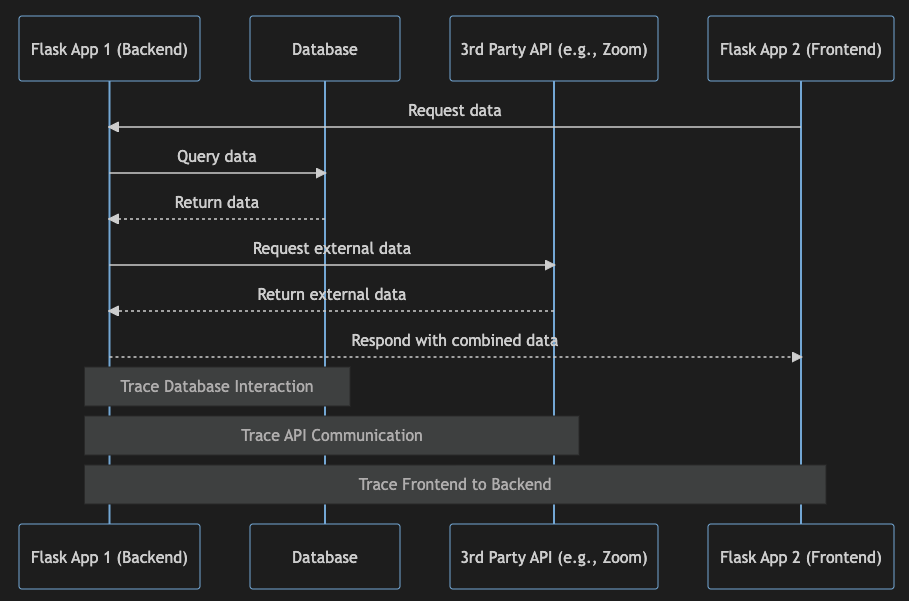

<!-- _class: lead -->

# Logging 
## Introduction to Logging in Health Informatics

**Hants Williams, PhD, RN**

---

# Final Project 

- Will be due on the last day of class (12/18/2024)
- Review the [final project requirements](../../Final/final.md)


---

# What is logging? 

- Logging is the process of recording events that occur in a computer system.
- Logs are used to record events for use in problem determination, auditing, and security.
- Logs are typically stored in a file or database.
- A log usually includes the timestamp and context payload for an event and can be emitted in various forms like plain text, structured format like json or binary logs.

--- 

# What a log is not
- A log is not supposed to be used as a database.
- Logging does not guarantee that you will be able to recover from a failure.
- It is not a substitute for a backup(s).
- It does not always help you discover the root cause of a problem, but it can help you narrow down the possibilities.

---

# Logging in the SDLC 
1. **Event Logs**: These logs capture specific events within an application or system. They focus on the actions and occurrences within the software, like user actions, transactions, system changes, and application-specific events. Event logs are more about what is happening within the application or software environment itself.

2. **Transaction Logs (DB)**: Every SQL  database has a transaction log that records all transactions and the database modifications made by each transaction. The transaction log is a critical component of the database. If there's a system failure, you'll need that log to bring your database back to a consistent state.

---
# Logging in the SDLC 
3. **Server Logs**: These are more comprehensive and include information about the server's operation where the application is running. Server logs record information like server requests and responses, server errors, system status, and network activities. They provide a broader view, encompassing not just the application but also the underlying server and network environment.

--- 

# Logging Best Practices 

1. Excessive logging might have the adverse effect as it might lead to increased costs for storage and reduce the search efficiency of the logs. So it becomes important to decide what data we need to log and what not.

2. Logs should contain all the contextual information that can provide some meaningful insight about the event.

3. Logging should always be in asynchronous manner and should not block the request processing flow.

---

# Logging Best Practices 

4. While pushing data to logs make sure that critical/sensitive data is not pushed or is properly masked before pushing.

5. Most event log data is relevant for a shorter period of time to unlike the analytical data that is needed for a longer run, so logs can have an archiving policy in place to improve the efficiency of the logging systems.


---

# Tracing in the SDLC

- Although logs provide good insight about system but they are limited to a single system/service and it becomes hard to understand anything else other than what’s happening inside a particular system. Thus creating a use case of another powerful tool called tracing.
- Tracing is focused on recording the flow of an application, particularly in complex, distributed systems.
- It tracks the **journey of a request as it moves through various services and components**.

---

# Tracing in the SDLC Example

- Flask App 1 (Backend)
- Database
- API (3rd party, e.g., Zoom)
- Flask App 2 (Frontend)

---

# Tracing in the SDLC Example




---
# Why is logging important in healthcare? 

- Patient safety
- Regulatory compliance
- Security

---

# Medical Systems and the Imperative of High Availability
**Example 1: Hospital Network Outage**
- Description: A hospital's network experiences a critical outage, causing delays in accessing patient records, lab results, and scheduling.
- Impact: Delayed patient care, increased wait times, potential for medical errors.
- Lesson: The outage highlights the need for robust systems capable of maintaining high availability to ensure uninterrupted healthcare delivery.

---
# Medical Systems and the Imperative of High Availability
**Example 2: Medical Device Outage**
- Description: A medical device experiences a critical outage, causing delays in patient monitoring and treatment.
- Impact: Delayed patient care, increased wait times, potential for medical errors.
- Lesson: The outage highlights the need for robust systems capable of maintaining high availability to ensure uninterrupted healthcare delivery.

---

# Real World Impacts in Healthcare
**1. OneTouchPoint Ransomware Attack:**

- This incident affected over 4.11 million individuals and involved a ransomware attack on a third-party vendor. Effective logging could have played a crucial role in early detection and mitigation of the breach. 

- With comprehensive logging, it would be possible to track unauthorized access or unusual activities on the servers before the ransomware payload deployment. This could lead to quicker incident response and potentially less data compromised. Furthermore, logs are vital for post-incident analysis to understand the breach's scope and prevent similar future occurrences​​.

---
# Real World Impact in Healthcare
**2. Eye Care Leaders Ransomware Attack:** 

In this complex case, the ransomware attack affected around 3.6 million patients. Proper logging in this scenario could have provided critical insights into the initial breach and subsequent data deletions and system configuration changes. 

Additionally, logging is essential for compliance with healthcare regulations like HIPAA, which would require a thorough investigation and reporting of the breach.

--- 

# Real World Impacts of System Outages in Healthcare
**3. United Health Faulty Ai Denies Patient Care**

- "The lawsuit, filed last Tuesday in federal court in Minnesota, claims UnitedHealth illegally denied "elderly patients care owed to them under Medicare Advantage Plans" by deploying an AI model known by the company to have a 90% error rate, overriding determinations made by the patients' physicians that the expenses were medically necessary."
- [https://www.cbsnews.com/news/unitedhealth-lawsuit-ai-deny-claims-medicare-advantage-health-insurance-denials/](https://www.cbsnews.com/news/unitedhealth-lawsuit-ai-deny-claims-medicare-advantage-health-insurance-denials/)
---

# Getting started with the built-in logging module

- The built-in logging module is part of the Python standard library.
- It provides a flexible framework for emitting log messages from Python programs.
- The logging module provides a default logger that can be used to log messages from your application.

---

# Exceptions in Python

- An exception is an error that occurs during the execution of a program.
- When an exception occurs, the program execution stops, and the code that follows it will not be executed.
- If an exception is not handled, the program will crash.
- Exceptions can be handled using `try/except` statements.

---

# Exceptions in Python

- The `try` block lets you test a block of code for errors.
- The `except` block lets you handle the error.
- The `finally` block lets you execute code, regardless of the result of the `try` and `except` blocks.

---

# Exceptions in Python

```python
try:
    # your code
except Exception as e:
    # handle the error
finally:
    # execute code, regardless of the result of the try and except blocks
```

This approach is useful when you want to handle specific exceptions. However, if you want to handle all exceptions, you can use the following syntax:

---

```python
try:
    # your code
except:
    # handle all exceptions
finally:
    # execute code, regardless of the result of the try and except blocks
```

---

Different types of exceptions in python include:
- `AssertionError` - Raised when an `assert` statement fails.
- `AttributeError` - Raised when attribute assignment or reference fails.
- `Exception` - Base class for all exceptions.
- `EOFError` - Raised when the `input()` function hits end-of-file condition.
- `FloatingPointError` - Raised when a floating point operation fails.
- `GeneratorExit` - Raise when a generator's `close()` method is called.
- `ImportError` - Raised when the imported module is not found.
- `IndexError` - Raised when the index of a sequence is out of range.
- `KeyError` - Raised when a key is not found in a dictionary.

---

Continued...
- `KeyboardInterrupt` - Raised when the user hits the interrupt key (Ctrl+C or Delete).
- `MemoryError` - Raised when an operation runs out of memory.
- `NameError` - Raised when a variable is not found in the local or global scope.
- `NotImplementedError` - Raised by abstract methods.
- `OSError` - Raised when a system operation causes a system-related error.
- `OverflowError` - Raised when the result of an arithmetic operation is too large to be represented.
- `ReferenceError` - Raised when a weak reference proxy is used to access a garbage collected referent.
- `RuntimeError` - Raised when an error does not fall under any other category.

---

# Logging Levels

- The logging module defines several logging levels, each with a corresponding numeric value.
- The default logging level is `WARNING`.

---

# Logging Levels

- The logging levels are listed below in order of increasing severity:
    - `DEBUG` - Detailed information, typically of interest only when diagnosing problems.
    - `INFO` - Confirmation that things are working as expected.
    - `WARNING` - An indication that something unexpected happened, or indicative of some problem in the near future (e.g., 'disk space low'). The software is still working as expected.
    - `ERROR` - Due to a more serious problem, the software has not been able to perform some function.
    - `CRITICAL` - A serious error, indicating that the program itself may be unable to continue running.

---

# Basic Logging Example

```python
import logging

logging.basicConfig(level=logging.DEBUG)

logging.debug('This is a debug message')
logging.info('This is an info message')
logging.warning('This is a warning message')
logging.error('This is an error message')
logging.critical('This is a critical message')
```

---

Now typically, you would include the actual error message in the log message. In this example, we are using an f-string to include the actual error message in the log message. The `{e}` in the f-string is replaced with the actual error message that is generated when the exception is raised.

```python
import logging

logging.basicConfig(level=logging.DEBUG)

try:
    1 / 0
except Exception as e:
    logging.error(f'An error occurred: {e}')
```

---

# Logging to a File and Custom Log Formats

**- Ensuring PHI Security:**
    - Avoid logging sensitive information.
    - Implement access controls for log files.
    - Encrypt log files at rest and in transit.
    - Implement a log retention policy.

```python
import logging

logging.basicConfig(filename='app.log', filemode='w', format='%(name)s - %(levelname)s - %(message)s')
logging.warning('This will get logged to a file')
```

---

# if/else vs. try/except

- When you are writing code, you should always try to use `if/else` statements instead of `try/except` statements.
- `try/except` statements are used to handle exceptions that are raised when your code is executed.
- `if/else` statements are used to handle conditions that are expected to occur when your code is executed.

---

# if/else vs. try/except

Example 1: `if/else` statement

```python

import logging

logging.basicConfig(level=logging.DEBUG)

if condition == True:
    logging.info('Condition is True')
else:
    logging.info('Condition is False')
```

---

# if/else vs. try/except

Example 2: `try/except` statement

```python
import logging

logging.basicConfig(level=logging.DEBUG)

try:
    1 / 0
except Exception as e:
    logging.error(f'An error occurred: {e}')
```

---

# Logging in Flask

**Integrating Logging in Flask Applications**
In Flask, you can integrate logging to monitor requests, responses, or any specific events.

1. Setup Flask Logging:
- Configure logging at the beginning of your Flask app.

```python
from flask import Flask
import logging

app = Flask(__name__)
logging.basicConfig(filename='app.log', level=logging.DEBUG)

```

---

# Logging in Flask

2. Logging in Flask:
- Log important information about incoming requests and outgoing responses.

```python
from flask import Flask, request
import logging

app = Flask(__name__)

@app.before_request
def before_request_logging():
    logging.debug("Received request: %s", request.url)

@app.after_request
def after_request_logging(response):
    logging.debug("Sent response with status: %s", response.status)
    return response
```

---

# Logging in Flask

3. Logging in Route Functions:
- Include logging statements in your route functions to track specific actions or catch errors.

```python
@app.route('/')
def index():
    try:
        # your code
        logging.info("Index page accessed")
    except Exception as e:
        logging.error("Error on index page: %s", str(e))
    return "Welcome to the Flask App"
```

---

# Sentry.io

- Sentry.io is a cloud-based error monitoring service that helps developers discover, triage, and prioritize errors in real-time.
- Sentry.io provides a Python SDK that can be used to integrate Sentry.io with your Python applications.
- Sentry.io provides a free plan that allows you to monitor up to 5,000 errors per month.


---

# Sentry.io - Example Flask App Integration

1. Create a Sentry.io account and create a new project.

2. Install the Sentry SDK in your Flask app.

```bash
pip install --upgrade sentry-sdk
```

---

3. Import the Sentry SDK in your Flask app.

```python

import sentry_sdk

sentry_sdk.init(
    dsn="YOUR CODE FROM SENTRY.IO WEBSITE GOES HERE",

    # Enable performance monitoring
    enable_tracing=True,
)

# Test Sentry.io integration
division_by_zero = 1 / 0
```

---

# Sentry.io - Example Flask App Integration

Then go to your Sentry.io dashboard and you should see the error that was generated.

---


